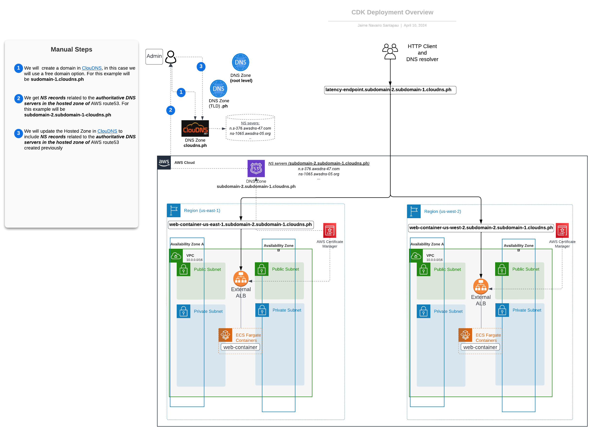
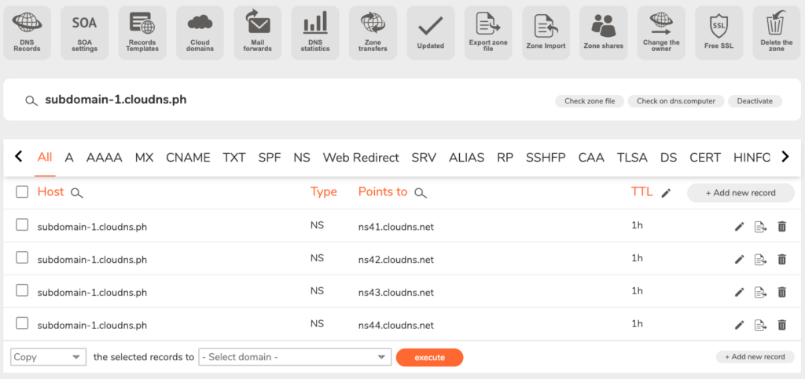
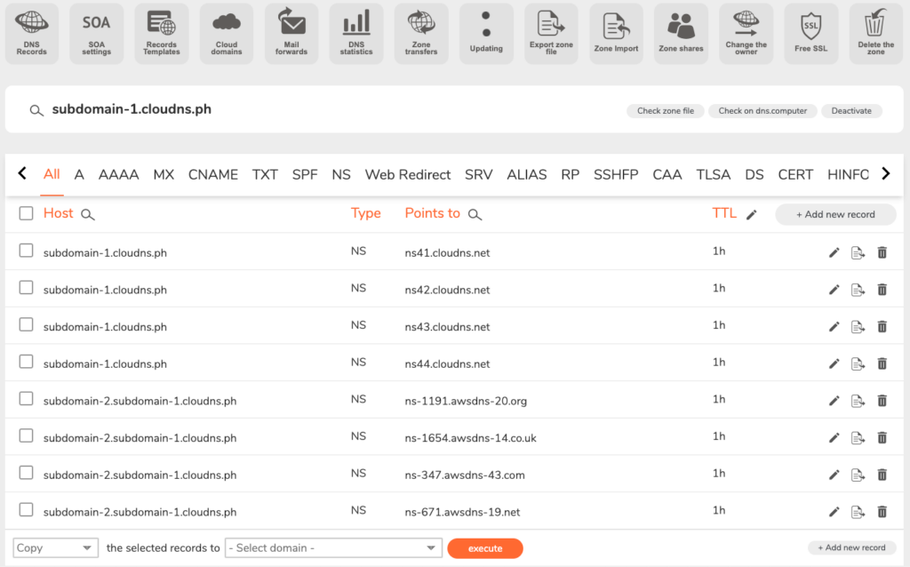

# Guide to deploy this infrastructure on AWS

## CDK Deployment Overview
The accompanying diagram illustrates the architecture of our deployed infrastructure, showcasing the relationships between key components. While the CDK stacks deploy infrastructure inside AWS Cloud, for external components like the DNS provider (ClouDNS), we will need to execute manual steps, highlighted in the following diagram


## Step 0 - Install dependencies
- AWS account credentials
  - Install AWS CLI https://docs.aws.amazon.com/cli/latest/userguide/getting-started-install.html
  - Get AWS credentials https://docs.aws.amazon.com/cli/latest/userguide/cli-configure-files.html
- NodeJS installation https://nodejs.org/en/download/

## Step 1 - Confirm AWS credentials
After getting AWS credentials, you will need to make sure that you pick the right ones(if you have more than one):
```bash
aws configure list-profiles
export AWS_DEFAULT_PROFILE=xxxxxxxxxx
export AWS_PROFILE=xxxxxxxxxx
```

Confirm AWS credentials are working by running the following commands:
```bash
aws configure list
aws sts get-caller-identity
```

## Step 2 - Configuration
> **Warning** Update the default public DNS domain (_subdomain-**2**.subdomain-**1**.cloudns.ph_) with your own domain name.

In [ClouDNS](https://www.cloudns.net) set up the following:
* Create a free DNS Hosted Zone (Example case: subdomain-**xx**.cloudns.ph)



In this GitHub repository, update the [configuration file](./config/environment.ts) with your own public domain name.
* DNS_ZONE_NAME: "_subdomain-2.subdomain-**xx**.cloudns.ph_"

```javascript
export const AppConfig = {
  VPC_NAME: 'vpc-web-container',
  CLUSTER_NAME: 'fargate-cluster-web-container',
  APP_NAME: 'app-region-evacuation',
  DNS_ZONE_NAME: 'subdomain-2.subdomain-1.cloudns.ph',
  INTERNAL_DNS: 'web-container',
  DOCKER_IMAGE: 'jaimenavarro/web-container'
};
```

## Step 3 - Build
These are the following steps to build the project:
* Make sure you are in the right folder
```bash
cd infrastructure/blog_post_3
```
* Install javascript dependencies
```bash
npm install -dd
npm run build -dd
```

## Step 4 - Setting up AWS CloudFormation
* It sets up the necessary AWS resources and configurations required to deploy your CDK stacks in CloudFormation.
```bash
npx cdk bootstrap  --region us-east-1
npx cdk bootstrap  --region us-west-2
```

* AWS CDK Synth the project
```bash
npx cdk context --clear
npx cdk synth 
```


## Step 5 - Deploy First CDK Stage
This command will deploy the basic infrastructure in region us-east-1, us-west-2:
* Creates a VPC that spans a whole region. It will automatically divide the provided VPC CIDR range, and create public and private subnets per Availability Zone. Network routing for the public subnets will be configured to allow outbound access directly via an Internet Gateway. Network routing for the private subnets will be configured to allow outbound access via a set of resilient NAT Gateways (one per AZ).
* Fargate cluster
* Route53 DNS public zone

```bash
npx cdk deploy stage-1/*  --require-approval never
```
You can review the status of your CDK deployment from AWS console 
* [CloudFormation us-east-1](https://us-east-1.console.aws.amazon.com/cloudformation/home?region=us-east-1)
* [CloudFormation us-west-2](https://us-east-1.console.aws.amazon.com/cloudformation/home?region=us-west-2)

## Step 6 - Configure ClouDNS with the NS records from AWS route53
Go to [AWS Route 53](https://us-east-1.console.aws.amazon.com/route53/v2/hostedzones) the hosted zone created in the previous step.
Copy the NS records related to the authoritative DNS servers.
* Example values:
```
ns-231.awsdns-28.com.
ns-1965.awsdns-53.co.uk.
ns-1055.awsdns-03.org.
ns-724.awsdns-26.net.
```

Go to your account in [ClouDNS](https://www.cloudns.net/) and open your free DNS zone (For our example was subdomain-**xx**.cloudns.ph). We will add four NS records, one for each authoritative DNS servers
* Type: NS record
* Host: subdomain-2.subdomain-**xx**.cloudns.ph
* Points to: ns-231.awsdns-28.com




You can confirm that the NS records are working fine by using the following online tool. **Keep in mind to use your own domain name. (For our example was subdomain-**xx**.cloudns.ph)**
* https://dnschecker.org/#NS/subdomain-2.subdomain-1.cloudns.ph


## Step 7 - Update CDK Context with the new resources
After creating basic infrastructure in the previous step we need to recreate the file cdk.context.json, which keeps information of the infrastructure in AWS, for that purpose we will use the following commands:
```bash
npx cdk context --clear 
npx cdk synth 
```

## Step 8 - Deploy Second CDK Stage
In this step, we will deploy web container tasks (web-server-container) in Fargate Cluster and its related infrastructure in (us-east-1, us-west-2):
* Deploys the web container tasks in Fargate Cluster
* Creates a public certificate in ACM. ( Step 6 needs to be working)
* Creates Application Load Balancer with the previously created certificate
* Creates Route53 DNS records to reach the web container.

```bash
npx cdk deploy stage-2/*  --require-approval never
```
You can review the status of your CDK deployment from AWS console:
* [CloudFormation us-east-1](https://us-east-1.console.aws.amazon.com/cloudformation/home?region=us-east-1)
* [CloudFormation us-west-2](https://us-east-1.console.aws.amazon.com/cloudformation/home?region=us-west-2)

## Validations Steps
You can use the following online resources to confirm that your public endpoint is available and the certificate is valid.
> **Warning** Update the following domains with your own domain name.
* Online DNS validation tool: 
  * https://dnschecker.org/#A/web-container-us-east-1.subdomain-2.subdomain-1.cloudns.ph
  * https://dnschecker.org/#A/web-container-us-west-2.subdomain-2.subdomain-1.cloudns.ph
  * https://dnschecker.org/#A/latency-endpoint.subdomain-2.subdomain-1.cloudns.ph
* Online SSL/TLS validation tool:
  * https://www.sslshopper.com/ssl-checker.html#hostname=https://web-container-us-east-1.subdomain-2.subdomain-1.cloudns.ph/
  * https://www.sslshopper.com/ssl-checker.html#hostname=https://web-container-us-west-2.subdomain-2.subdomain-1.cloudns.ph/
  * https://www.sslshopper.com/ssl-checker.html#hostname=https://latency-endpoint.subdomain-2.subdomain-1.cloudns.ph/
* HTTP Client validation:
```bash
curl -v https://web-container-us-east-1.subdomain-2.subdomain-1.cloudns.ph
curl -v https://web-container-us-west-2.subdomain-2.subdomain-1.cloudns.ph
curl -v https://latency-endpoint.subdomain-2.subdomain-1.cloudns.ph
```

## Remove all resources from your AWS account
In order to remove all the resources go to your [cloudformation console](https://us-east-1.console.aws.amazon.com/cloudformation/home?region=us-east-1) and delete the stacks in the inverse order:
1. Remove the DNS records with type CNAME in [Route 53](https://us-east-1.console.aws.amazon.com/route53/v2/hostedzones?region=us-east-1#) created by Certificates Manager

2. Execute the following commands:
```bash
npx cdk destroy stage-2/* stage-1/*
```
